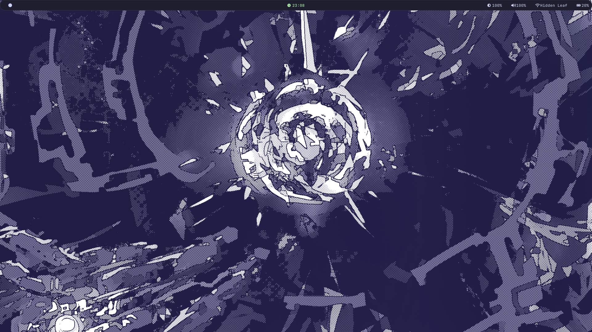
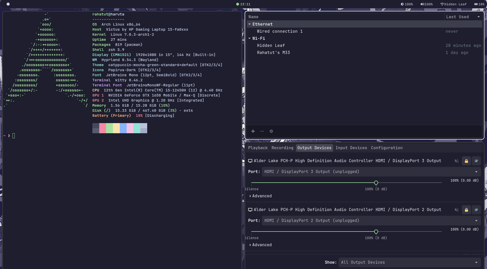
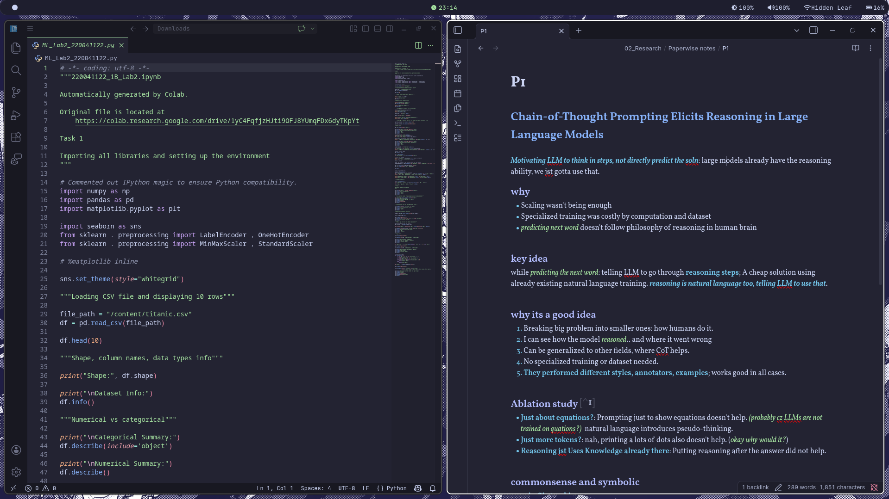
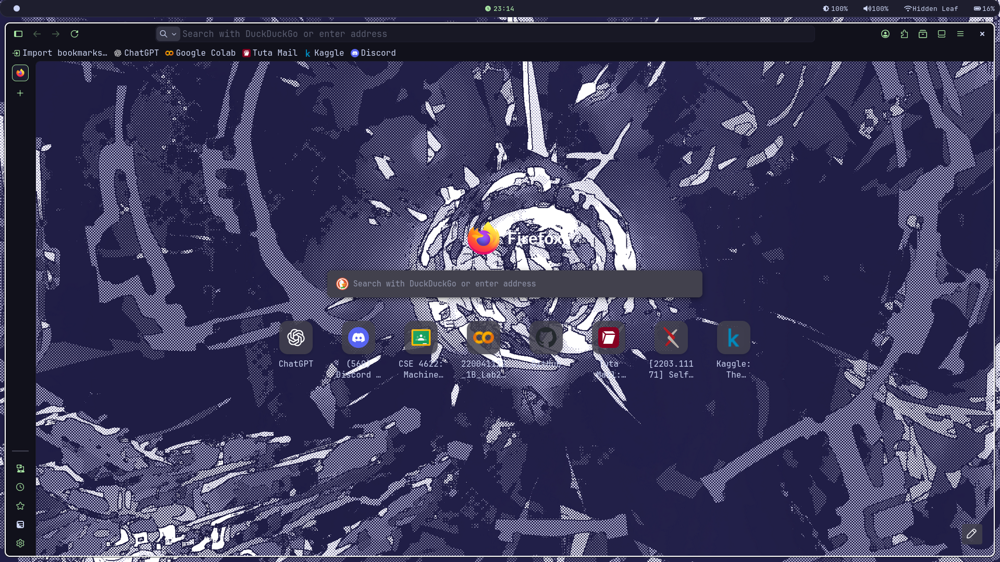

# My Arch setup Dotfiles

These are my personal config files for a minimal Niri setup built around the Catppuccin Mocha palette with soft green aesthetic.

---

## Environment

* Window Manager: Niri
* Terminal: Kitty
* Shell: Zsh
* Bar: Waybar
* Launcher: Wofi
* Notifications: Mako
* Logout Menu: Wlogout
* Lockscreen: Hyprlock
* Display Manager: SDDM (Sugar Candy Theme)
* Session entry: Niri (`niri-session`)
* File Manager: Thunar
* Fetch Tool: Fastfetch

---

## Theme & Styling

### GTK Theme

* Catppuccin Mocha Green

### Icons

* Papirus-Dark
* Nordic Papirus folder recolor

### Fonts

* JetBrainsMono Nerd Font

### Wallpaper

* Custom self-designed wallpaper

---

# Other applications


## VS Code

Using:

* Catppuccin Mocha theme
* Catppuccin icons
* JetBrainsMono Nerd Font

---

## Obsidian

Configured with:

* Catppuccin Mocha theme
* matching dark UI aesthetic

---

# Theme Sources

## Catppuccin

https://github.com/catppuccin/catppuccin

## Papirus Icons

https://github.com/PapirusDevelopmentTeam/papirus-icon-theme

## Papirus Folders

https://github.com/PapirusDevelopmentTeam/papirus-folders

## Sugar Candy SDDM

https://github.com/Kangie/sddm-sugar-candy

---

# Installation

Clone the repo:

```bash
git clone <your-repo-url> ~/dotfiles
```

Copy the compositor and app configs into `~/.config`.
Install the Niri session entry to your Wayland sessions directory so SDDM can show it.

To install the session entry, run `./scripts/install-niri-session.sh` from this repo root.

---

# Screenshots









---


